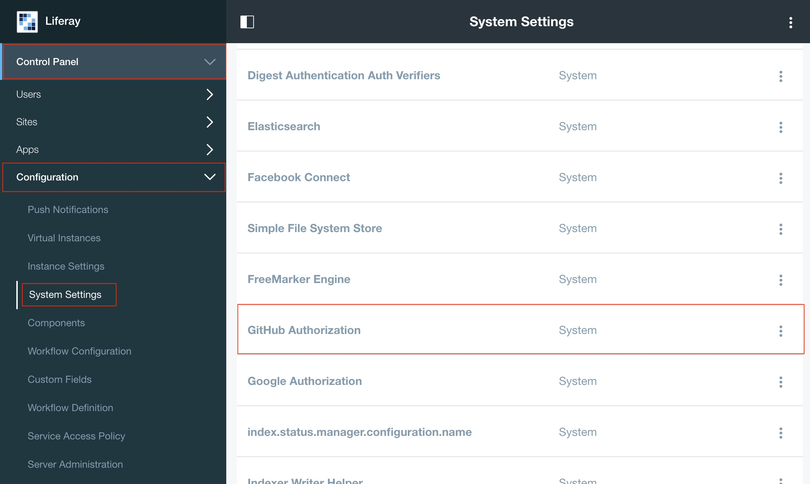
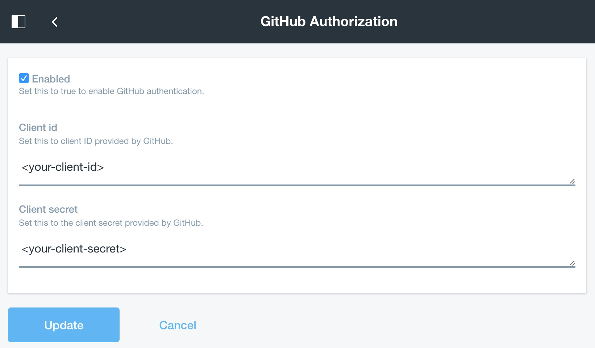

# Portal Security SSO GitHub

This OSGi module will provide business logic to connect with both systems, GitHub and Liferay, allowing users to authenticate in Liferay via GitHub.

* Provides the credential and configuration to connect to GitHub and use their APIs. 
* Provides the implementation to connect to GitHub using the OAuth2 authentication obtaining the user details provided by GitHub.
* Provides the implementation to add (or update) Liferay users account with the user details provided by GitHub.
* Automatically log in the user in Liferay after a successful authentication in GitHub.

This module depends on the following OSGi modules that should also be deployed in Liferay Portal to provide GitHub Login functionality:

* [Login Authentication GitHub Web](https://github.com/sergiogonzalez/github-liferay-suite/tree/master/login-authentication-github-web)

## Configuration

This plugin is disabled by default when deployed. Additionaly, it requires the following GitHub credentials before functionality is ready to be used:

* Client ID.
* Client Secret.

The Client ID and the Client Secret credentials are provided by GitHub when a new Developer Application is created. See [here](https://github.com/sergiogonzalez/github-liferay-suite/tree/master/login-authentication-github-web#configuration) how to create a new GitHub application.

These additional settings must be provided to the module using Liferay Control Panel > Configuration > System Settings > Foundation > GitHub Authorization.

